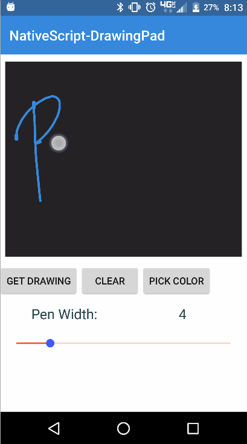

[](https://www.npmjs.com/package/nativescript-drawingpad)
[](https://www.npmjs.com/package/nativescript-drawingpad)

# NativeScript-DrawingPad :pencil:
NativeScript plugin to provide a way to capture any drawing (signatures are a common use case) from the device.
You can use this component to capture really anything you want that can be drawn on the screen. Go crazy with it!!!

*Formally this plugin was **nativescript-signaturepad**, to improve visiblity and adoption it has been renamed.*

## Samples

Android |  iOS 
-------- | ---------
 | 

#### Native Libraries: 
Android | iOS
---------- | -----------
[gcacace/android-signaturepad](https://github.com/gcacace/android-signaturepad) |  [SignatureView](https://cocoapods.org/pods/SignatureView)

## Installation
From your command prompt/termial go to your app's root folder and execute:

#### NativeScript 3.0+
`tns plugin add nativescript-drawingpad`

#### NativeScript < 3
`tns plugin add nativescript-drawingpad@1.1.2`

## Video Tutorial
[Egghead lesson - https://egghead.io/lessons/javascript-capture-drawings-and-signatures-in-a-nativescript-app](https://egghead.io/lessons/javascript-capture-drawings-and-signatures-in-a-nativescript-app)

## Usage
#### XML:
```XML
<Page xmlns="http://schemas.nativescript.org/tns.xsd" xmlns:DrawingPad="nativescript-drawingpad" loaded="pageLoaded">
    <ActionBar title="NativeScript-DrawingPad" />
    <ScrollView>
        <StackLayout>
        
            <DrawingPad:DrawingPad 
            height="400" 
            id="drawingPad" 
            penColor="{{ penColor }}" penWidth="{{ penWidth }}" />
            
        </StackLayout>
    </ScrollView>
</Page>
```

### TS:
```TS
import { topmost } from 'ui/frame';
import { DrawingPad } from 'nativescript-drawingpad';

// To get the drawing...

  public getMyDrawing() {      
      let drawingPad = topmost().getViewById('myDrawingPad');      
      drawingPad.getDrawing().then((res) => {        
          console.log(res);    
       });  
    }


// If you want to clear the signature/drawing...
public clearMyDrawing() {
    let drawingPad = topmost().getViewById('myDrawingPad');      
    drawingPad.clearDrawing();
}

```

## Angular:
```javascript
import {Component, ElementRef, ViewChild} from '@angular/core';
import {registerElement} from "nativescript-angular/element-registry";

registerElement("DrawingPad", () => require("nativescript-drawingpad").DrawingPad);

@Component({
    selector: 'drawing-pad-example',
    template: `
    <ScrollView>
        <StackLayout>
            <DrawingPad #DrawingPad 
            height="400" 
            id="drawingPad" 
            penColor="#ff4081" penWidth="3">
            </DrawingPad>

            <StackLayout orientation="horizontal">
                <Button text="Get Drawing" (tap)="getMyDrawing()"></Button>
                <Button text="Clear Drawing" (tap)="clearMyDrawing()"></Button>
            </StackLayout>
        </StackLayout>
    </ScrollView>
    `
})
export class DrawingPadExample {

    @ViewChild("DrawingPad") DrawingPad: ElementRef;

    getMyDrawing(args) {
        // get reference to the drawing pad
        let pad = this.DrawingPad.nativeElement;

        // then get the drawing (Bitmap on Android) of the drawingpad
        let drawingImage;
        pad.getDrawing().then(function(data) {
            console.log(data);
            drawingImage = data;
        }, function(err) {
            console.log(err);
        });
    }

    clearMyDrawing(args) {
        var pad = this.DrawingPad.nativeElement;
        pad.clearDrawing();
    }
}
```


## Attributes
**penColor - (color string)** - *optional*

Attribute to specify the pen (stroke) color to use.
 
**penWidth - (int)** - *optional*

Attribute to specify the pen (stroke) width to use.

## Methods

**getDrawing()** - Promise *(returns image if successful)*

**clearDrawing()** - clears the drawing from the DrawingPad view.

#### *Android Only*

- **getTransparentDrawing()** - Promise (returns a bitmap with a transparent background)
- **getDrawingSvg()** - Promise (returns a Scalable Vector Graphics document)

